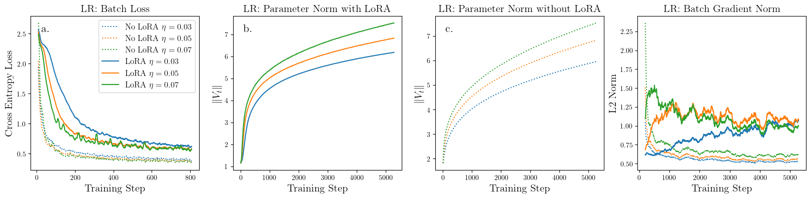
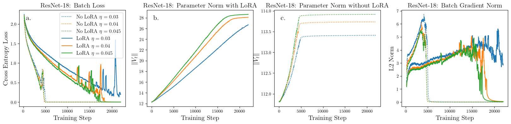
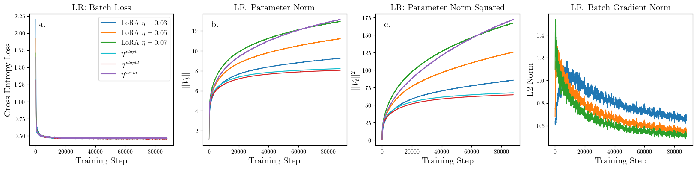
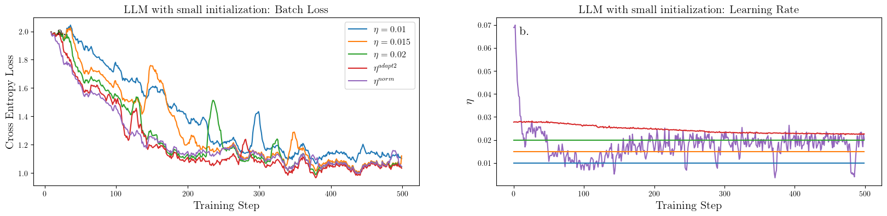
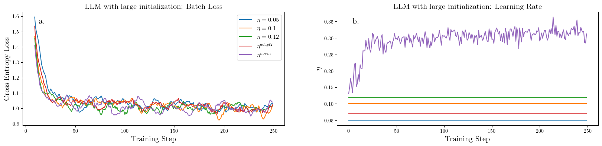

# On the Convergence Rate of LoRA Gradient Descent

To train the logistic regression model using LoRA and a constant learning rate, first generate the CIFAR-10 embeddings with `feature_extraction.py` and run

`python3 -u main.py --model logreg --dataset extracted_cifar10 --use_lora --lora_rank 4 --lr 0.02 --num_classes 10 --epochs 60  --batch_size 512`

To generate the data in the paper, run
`bash logreg_script.sh` and `bash resnet_script.sh`

# Figures for ICML Rebuttal Period

## Figure A

## Figure B

## Figure C

## Figure D

The B matrix is initialized with a Gaussian distribution, with $\sigma = 1e-3$.

## Figure E

The B matrix is initialized with a Gaussian distribution, with $\sigma = 1/r$ and $r = 32$.
